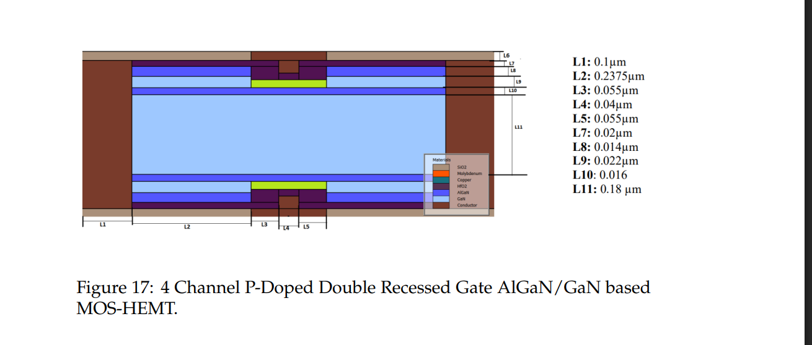
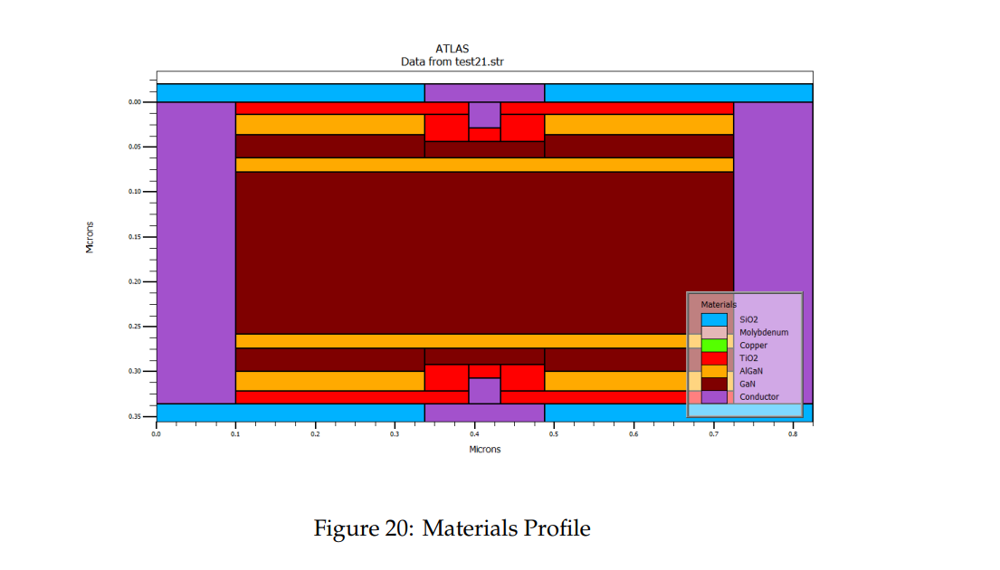
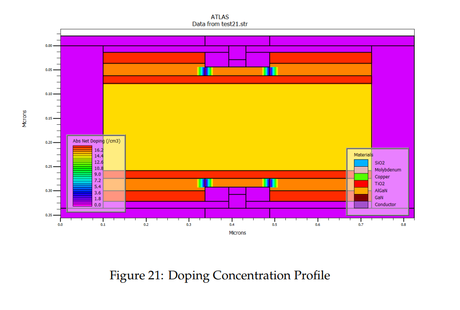
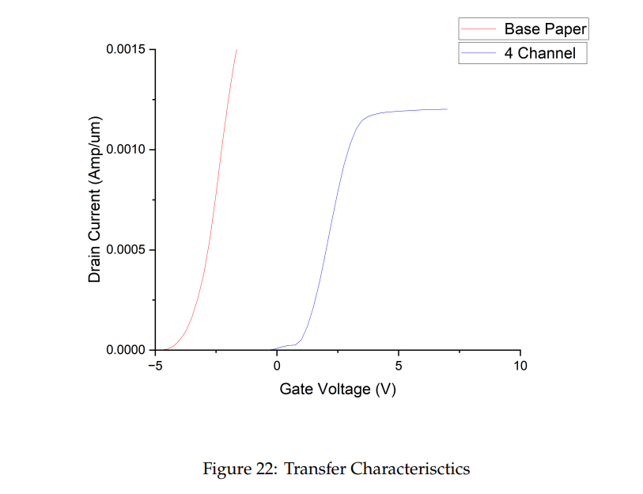
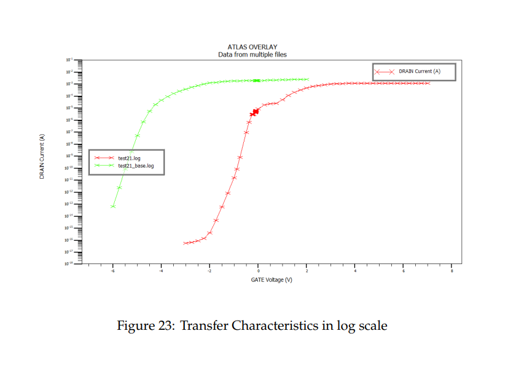
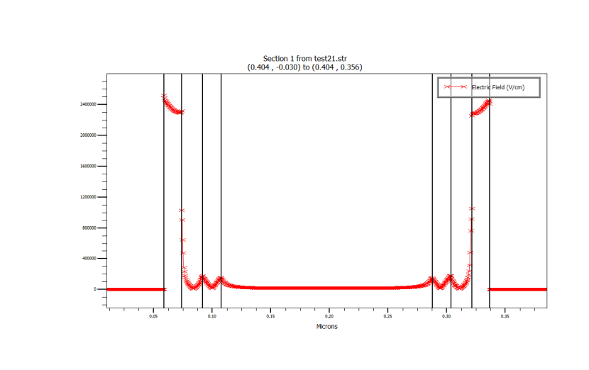

# AlGaN/GaN 4-Channel P-Doped Double Recessed Gate MOS-HEMT
### Bachelor Thesis — Device Simulation using Silvaco ATLAS

---

## Overview

This project presents the design, simulation, and analysis of a novel **4-Channel P-Doped Double Recessed Gate AlGaN/GaN MOS-HEMT** (Metal-Oxide-Semiconductor High Electron Mobility Transistor). The device was fully simulated using **Silvaco ATLAS**, a physics-based 2D/3D device simulator, and benchmarked against a conventional base-paper design.

The central motivation behind this work was to push the switching performance of GaN-based transistors further — specifically to achieve a more positive threshold voltage (enhancement-mode operation), better off-state leakage suppression, and a high Ion/Ioff ratio — all while maintaining the inherently high carrier mobility that makes GaN devices attractive for power electronics and RF applications.

---

## Proposed Device Structure

The proposed device is a **symmetrical, vertically stacked multi-channel HEMT** that integrates four two-dimensional electron gas (2DEG) channels between alternating AlGaN/GaN heterojunction layers. A double recessed Molybdenum gate with a TiO₂ gate insulator controls both the top and bottom channel stacks simultaneously.



> *Figure: Cross-sectional view of the 4-Channel P-Doped Double Recessed Gate AlGaN/GaN MOS-HEMT. The Molybdenum gate (green) is recessed into both the top and bottom gate stacks, with SiO₂ passivation on the sides, and Copper ohmic contacts serving as Source and Drain.*

### Key Design Parameters

| Parameter | Value |
|-----------|-------|
| Al composition in AlGaN | 25% |
| AlGaN barrier thickness | ~22 nm |
| GaN channel thickness | ~18 nm |
| Gate dielectric | TiO₂ |
| Gate metal | Molybdenum (Work function: 5.2 eV) |
| Source/Drain metal | Copper |
| Passivation | SiO₂ |
| Total device height | ~356 nm |
| Gate length | ~55 nm |

---

## Materials & Doping Profile

The simulation structure consists of several carefully engineered material regions stacked vertically. The AlGaN barrier layers are uniformly n-doped at **1×10¹⁸ cm⁻³** to populate the 2DEG channels, while p-type doping (**2×10¹⁶ cm⁻³**) is strategically introduced in the GaN layers directly beneath the gate recess. This p-doping is what shifts the threshold voltage in the positive direction, enabling enhancement-mode (normally-off) behaviour.



> *Figure: ATLAS-rendered materials profile of the simulated device. The dark red GaN bulk, orange AlGaN barriers, and red TiO₂ gate insulator regions are clearly distinguishable. The gate recess and the symmetrical top/bottom structure are evident.*



> *Figure: Absolute net doping concentration map (log scale, /cm³) from the ATLAS simulation. High-concentration n-type doping (red/orange, ~10¹⁸ cm⁻³) is visible in the AlGaN barrier layers and upper GaN, while the lightly doped GaN bulk (yellow, ~10¹⁵ cm⁻³) forms the low-field drift region.*

---

## Simulation Setup

All simulations were carried out in **Silvaco ATLAS** using the following physics models:

- **CVT** — Lombardi surface mobility model
- **SRH** — Shockley-Read-Hall recombination
- **FLDMOB** — Field-dependent mobility (velocity saturation)
- **CCSMOB** — Concentration and carrier scattering mobility
- **DGLOG** — Density gradient quantum correction
- **AUGER** — Auger recombination
- **BGN** — Bandgap narrowing
- **ALBRCT** — Albrecht mobility model for GaN (electron mobility)

The Newton and Gummel-Newton solvers were used with adaptive step sizes. Transfer characteristics were swept from V_GS = −4 V to +10 V, with an AC frequency of 1 GHz for small-signal parameter extraction.

---

## Results

### Transfer Characteristics (Id–Vgs)



> *Figure: Transfer characteristics comparing the Base Paper design (red) and the proposed 4-Channel device (blue) in linear scale. The 4-Channel design shows a significantly more positive threshold voltage (~+3.5 V), confirming enhancement-mode operation — a critical requirement for fail-safe power switching. The base paper design turns on near −4 V (depletion mode).*

The shift to a positive threshold voltage is one of the most significant outcomes of this work. Conventional AlGaN/GaN HEMTs are naturally depletion-mode devices (normally-on), which poses a safety risk in power converter applications. By combining p-type doping and the double recessed gate geometry, this design achieves **normally-off** operation without sacrificing drive current capability.

---

### Transfer Characteristics (Log Scale — Ion/Ioff)



> *Figure: Logarithmic Id–Vgs plot comparing the base reference device (green) and the 4-Channel design (red). The proposed device achieves an Ion/Ioff ratio exceeding **10¹⁰**, representing a dramatic improvement in switching contrast. The steep subthreshold slope and low off-state leakage current (reaching below ~10⁻¹⁶ A) indicate excellent gate control and minimal standby power dissipation.*

The log-scale plot highlights just how effectively the p-doped recessed gate suppresses leakage in the off-state. The off-current floor in the 4-Channel device drops several orders of magnitude lower than the base design, which is critical for high-frequency and low-power switching applications.

---

### Electric Field Profile



> *Figure: Vertical electric field distribution along the gate cross-section (x = 0.404 µm), from the top gate to the bottom gate. Peak fields of ~2.4 MV/cm appear at the gate-dielectric interfaces (top and bottom), while the GaN bulk region between the channels remains relatively field-free. This symmetric distribution confirms that both gate stacks are operating equivalently and that the TiO₂ dielectric is effectively screening the channel.*

The electric field profile also reveals that the field crowding is contained within the dielectric regions rather than at the AlGaN/GaN interface, which helps reduce hot-carrier effects and improves long-term device reliability.

---

## Key Extracted Parameters

| Parameter | Value |
|-----------|-------|
| Threshold Voltage (Vt) | ~+3.5 V (enhancement mode) |
| Maximum Drain Current (Idss) | ~1.2 mA/µm |
| Ion/Ioff Ratio | > 10¹⁰ |
| Off-state leakage (Ioff) | < 10⁻¹⁶ A |
| Peak Electric Field | ~2.4 MV/cm (at gate dielectric) |
| Gate workfunction (Mo) | 5.2 eV |

---

## Repository Structure

```
Bachelor-thesis-AlGaN-GaN-hemt-main/
│
├── Silvaco-code/
│   └── test21x.in              # Full ATLAS simulation deck
│
├── Proposed-Structure/
│   ├── 4-channel-hemt-strcture.png   # Device cross-section schematic
│   ├── Materials-Profile.png          # ATLAS materials map
│   └── Doping-Profile.png             # ATLAS doping concentration map
│
├── Results/
│   ├── Improved_Id_VGaate.png         # Transfer characteristics (linear)
│   ├── Id-VG_log.png                  # Transfer characteristics (log scale)
│   └── Electric-field-profile.png     # Vertical electric field profile
│
└── Thesis-report.pdf                  # Full bachelor thesis report
```

---

## How to Run the Simulation

1. Open **Silvaco ATLAS** (tested with Silvaco TCAD suite).
2. Load the simulation deck:
   ```
   deckbuild -run Silvaco-code/test21x.in
   ```
3. Results will be saved to `test21x.str` (structure file) and `test21x.log` (electrical log).
4. Visualize using **TonyPlot**:
   ```
   tonyplot test21x.str
   tonyplot test21x.log
   ```

---

## Conclusion

This thesis demonstrates that a **4-channel p-doped double recessed gate MOS-HEMT** architecture can successfully convert a conventionally depletion-mode AlGaN/GaN device into an enhancement-mode one, with a threshold voltage of approximately +3.5 V. The Ion/Ioff ratio exceeding 10¹⁰, combined with well-distributed electric fields and low off-state leakage, positions this design as a strong candidate for next-generation GaN power transistors in applications demanding high efficiency, high voltage operation, and reliable normally-off switching behaviour.

---

*Simulated using Silvaco ATLAS | Bachelor Thesis Project*
